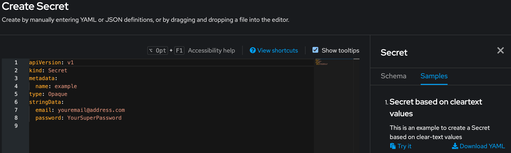
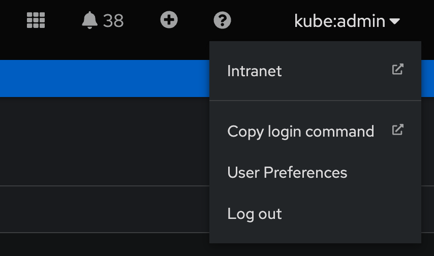
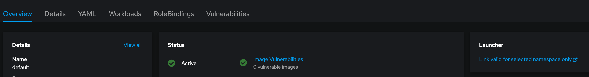
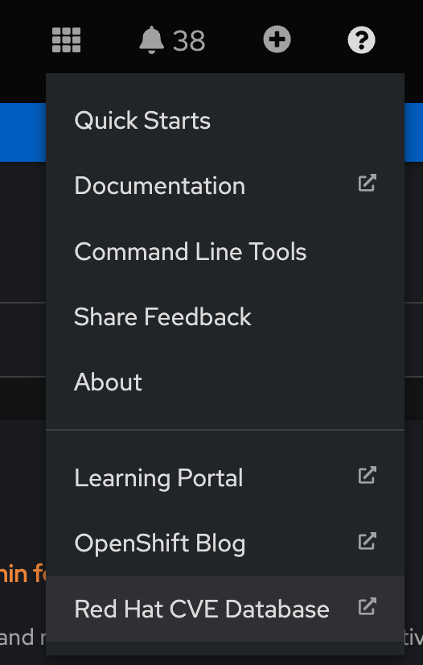
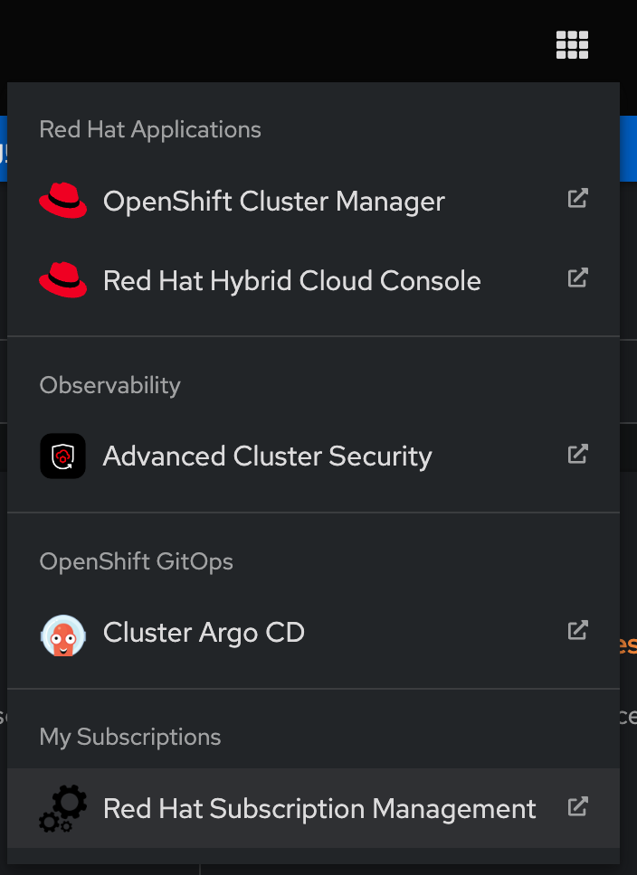

# generic-cluster-config

  [](https://opensource.org/licenses/Apache-2.0)

  

 

  ## Description

  This Chart is responsible for deploying generic cluster configuration, for example, etcd encryption, OAuth etc.

Configure your cluster with basic settings. Any generic and repeatable configuration goes in here. This helps me to quickly deploy Lab environments and demonstrate features.

It is best used with a GitOps approach such as Argo CD does. For example, https://github.com/tjungbauer/openshift-clusterconfig-gitops

Multiple Argo CD applications are using this Chart as a dependency to enable different aspects of the cluster (i.e., etcd encryption).

Currently, the following settings can be done:

- Encrypt ETCD
- Disable Self-Provisioner
- Configure Identity Providers (LDAP or htpasswd)
- Limit Allowed Registries
- Configure Monitoring and User-Workload Monitoring
- Add Console Banner (Top and Bottom)
- Add Console Links
- Add YAML Samples into the console

## Dependencies

This chart has the following dependencies:

| Repository | Name | Version |
|------------|------|---------|
| https://redhat-cop.github.io/helm-charts | tpl | ~1.0.0 |

None

## Maintainers

| Name | Email | Url |
| ---- | ------ | --- |
| tjungbauer | <tjungbau@redhat.com> | <https://blog.stderr.at/> |

## Sources
Source:

Source code: https://redhat-cop.github.io/helm-charts/tree/main/charts/generic-cluster-config

## Parameters

*TIP*: Verify the values.yaml to see possible additional settings.

## Values

| Key | Type | Default | Description |
|-----|------|---------|-------------|
| apiserver.audit.profile | string | Default | Set to Default, WriteRequestBodies, AllRequestBodies, or None. The default profile is Default |
| apiserver.custom_cert.cert_names | list | N/A | List of names the certificate is valid |
| apiserver.custom_cert.enabled | bool | false | custom certificate enabled? |
| apiserver.custom_cert.secretname | string | api-certificate | Name of the secret that holds the certificate |
| apiserver.enabled | bool | `false` | Enable APIServer configuration in general |
| apiserver.etcd_encryption.enabled | bool | false | Enable ETCD encryption in OpenShift |
| apiserver.etcd_encryption.encryption_type | string | aesgcm | Type of encryption. This can either be: <br /> <ul> <li>AES-CBC - Uses AES-CBC with PKCS#7 padding and a 32 byte key to perform the encryption. The encryption keys are rotated weekly.</li> <li>AES-GCM - Uses AES-GCM with a random nonce and a 32 byte key to perform the encryption. The encryption keys are rotated weekly.</li> <ul> |
| apiserver.etcd_encryption.namespace | string | `"openshift-gitops"` | The Namespace where the Pod that verifies the status of the encryption will be started. If you encrypt the ETCD on a cluster without GitOps, this namespace must be changed. For example to "kube-system" |
| apiserver.etcd_encryption.serviceAccount | object | `{"create":true,"name":"etcd-encryption-checker"}` | The service account that is used to verify the status of the encryption |
| config_allowed_registries.allowedRegistriesForImport | list | empty | limits the container image registries that normal users may import images from. |
| config_allowed_registries.allowedRegistriesForImport[0] | object | `{"domain":"quay.io","insecure":false}` | Domainname of the registry |
| config_allowed_registries.allowedRegistriesForImport[0].insecure | bool | false | Validate the vertificate of not |
| config_allowed_registries.enabled | bool | false | Enable configuration to limit the registries |
| config_allowed_registries.registry_sources.allowed_registries | list | empty | When pulling or pushing images, the container runtime searches the registries listed here |
| console.console_banners | object | '' | Configure banners for the WebUI. This can either be: topbanner or bottombanner |
| console.console_banners.bottombanner | object | '' | Configure BOTTOM-banner |
| console.console_banners.bottombanner.backgroundcolor | string | '' | Define the background colour for the banner |
| console.console_banners.bottombanner.color | string | '' | Select the font colour in the banner |
| console.console_banners.bottombanner.enabled | bool | false | Enable bannler configuration |
| console.console_banners.bottombanner.link | object | '' | Add a link to the banner with href and a text |
| console.console_banners.bottombanner.location | string | '' | Define the location for the banner. Either BannerTop or BannerBottom |
| console.console_banners.bottombanner.text | string | '' | Set a text that shall be displayed. |
| console.console_banners.topbanner | object | '' | Configure TOP-banner |
| console.console_banners.topbanner.backgroundcolor | string | '' | Define the background colour for the banner |
| console.console_banners.topbanner.color | string | '' | Select the font colour in the banner |
| console.console_banners.topbanner.enabled | bool | false | Enable bannler configuration |
| console.console_banners.topbanner.link | object | '' | Add a link to the banner with href and a text |
| console.console_banners.topbanner.location | string | '' | Define the location for the banner. Either BannerTop or BannerBottom |
| console.console_banners.topbanner.text | string | '' | Set a text that shall be displayed. |
| console.console_links.userlink.applicationMenu | object | `{"imageURL":"https://raw.githubusercontent.com/tjungbauer/helm-charts/gh-pages/images/configuration.png","section":"My Subscriptions"}` | In case of ApplicationMenu a section and a URL for the icon can be provided. |
| console.console_links.userlink.enabled | bool | false | Enable ConsoleLink ? |
| console.console_links.userlink.href | string | '' | Target of the link |
| console.console_links.userlink.location | string | '' | Location of the ConsoleLink - Create a link for a user in the appropriate location. This is the menu when you click on your name. An additional link will be added there.<br /> <ul> <li>UserMenu</li> <li>NamespaceDashboard</li> <li>ApplicationMenu</li> <li>HelpMenu</li> </ul> |
| console.console_links.userlink.namespaces | list | `["namespace1","namespace2"]` | In case of NamespaceDashboard it is possible to define a list of specific namespace. |
| console.console_links.userlink.text | string | '' | Text that should be shown as the link. |
| console.yamlsamples.secret-yaml-sample | object | '' | Key for the ConsoleYAMLSample. Multiple keys can be defined. |
| console.yamlsamples.secret-yaml-sample.descr | string | '' | Description for the ConsoleYAMLSample |
| console.yamlsamples.secret-yaml-sample.enabled | bool | false | Enable this ConsoleYAMLSample |
| console.yamlsamples.secret-yaml-sample.targetresource | object | `{"apiversion":"v1","kind":"secret"}` | Define the target resource and the api version. |
| console.yamlsamples.secret-yaml-sample.title | string | '' | Title for the ConsoleYAMLSample |
| console.yamlsamples.secret-yaml-sample.yamlDef | string | '' | The actual example as it will be shown in the UI. This is gives as a valid YAML and will be bypassed to the template. |
| idp.customloginpage | object | '' | Besides IDP configuration, custom Login pages can be defined here as well. This requires secrets with the actual HTML. |
| idp.customloginpage.enabled | bool | false | Enable custom Login pages? |
| idp.customloginpage.secretname | string | '' | Name of the secret for the custom Login page. |
| idp.customloginpage.secretname_providerpage | string | '' | Name of the secret for the custom provider page (The page where you select the oauth providers) |
| idp.enabled | bool | false | Enable IDP configuration |
| idp.providers.enabled | bool | false | Enable IDP configuration. You can still disable them individually. |
| idp.providers.htpasswd | list | '' | Use HTPASSWD provider. |
| idp.providers.htpasswd[0] | object | htpasswd | Provide a name for that provider. This will be visible on the login page. |
| idp.providers.htpasswd[0].enabled | bool | false | Enable htpasswd? |
| idp.providers.htpasswd[0].secretname | string | htpasswd-secret | The name of the secret that holds the encrypted htpasswd information |
| idp.providers.ldap | list | '' | User LDAP provider. |
| idp.providers.ldap[0] | object | ldap | Provide a name for that provider. This will be visible on the login page. |
| idp.providers.ldap[0].attributes | object | `{"email":["mail"],"id":["dn"],"name":["cn"]}` | List of attributes to use as the identity. First non-empty attribute is used. At least one attribute is required. If none of the listed attribute have a value, authentication fails. |
| idp.providers.ldap[0].binddn | string | `"your-bindDN"` | BindDN for the LDAP connection |
| idp.providers.ldap[0].cmname | string | ca-config-map | Name of the ConfigMap the stores the certificate |
| idp.providers.ldap[0].enabled | bool | false | Enable htpasswd? |
| idp.providers.ldap[0].insecure | bool | true | Is the connection to the LDAP server insecure or not? |
| idp.providers.ldap[0].preferredusername | list | '' | List of attributes to use as the preferred user name when provisioning a user for this identity. First non-empty attribute is used |
| idp.providers.ldap[0].secretname | string | `"ldap-secret"` | Name of the secret that stores the bindPassword @default: ldap-secret |
| idp.providers.ldap[0].url | string | '' | URL to the LDAP server |
| monitoring.alertmanagerMain.disable_local_alertmanager | bool | false | Disable cluster Alertmanager. |
| monitoring.alertmanagerMain.nodeSelector | object | empty | nodeSelector for Alertmanager Pods |
| monitoring.alertmanagerMain.resources | object | empty | Resources set for the Alertmanager. Set these with care. If nothing is set, then no limits or requests will be configured. |
| monitoring.alertmanagerMain.secrets | list | empty | Add a list of secrets that are mounted to Alertmanager. These can have credentials or certificates to authenticat against the alert receiver |
| monitoring.alertmanagerMain.storage.class | string | gp2-csi | StorageClass for persistent volume |
| monitoring.alertmanagerMain.storage.size | string | 40Gi | Size for the storage |
| monitoring.alertmanagerMain.tolerations | list | empty | Tolerations for Alertmanager Pods. The configuration is handed over as YAML to the template. |
| monitoring.enableUserWorkload | bool | false | Enable user workload monitoring |
| monitoring.enabled | bool | false | Enable cluster monitoring configuration |
| monitoring.k8sPrometheusAdapter.nodeSelector | object | empty | nodeSelector for Prometheus Adapter Pods |
| monitoring.k8sPrometheusAdapter.resources | object | empty | Resources set for the Prometheus Adapter. Set these with care. If nothing is set, then no limits or requests will be configured. |
| monitoring.k8sPrometheusAdapter.tolerations | list | empty | Tolerations for Prometheus Adapter Pods. The configuration is handed over as YAML to the template. |
| monitoring.kubeStateMetrics.nodeSelector | object | empty | nodeSelector for Kube StateMetrics Pods |
| monitoring.kubeStateMetrics.resources | object | empty | Resources set for the Kube StateMetrics. Set these with care. If nothing is set, then no limits or requests will be configured. |
| monitoring.kubeStateMetrics.tolerations | list | empty | Tolerations for Kube StateMetrics Pods. The configuration is handed over as YAML to the template. |
| monitoring.monitoringPlugin.nodeSelector | object | empty | nodeSelector for Monitoring Plugin Pods |
| monitoring.monitoringPlugin.resources | object | empty | Resources set for the Monitoring Plugin. Set these with care. If nothing is set, then no limits or requests will be configured. |
| monitoring.monitoringPlugin.tolerations | list | empty | Tolerations for Monitoring Plugin Pods. The configuration is handed over as YAML to the template. |
| monitoring.openshiftStateMetrics.nodeSelector | object | empty | nodeSelector for OpenShift State Metrics Pods |
| monitoring.openshiftStateMetrics.resources | object | empty | Resources set for the OpenShift State Metrics. Set these with care. If nothing is set, then no limits or requests will be configured. |
| monitoring.openshiftStateMetrics.tolerations | list | empty | Tolerations for OpenShift State Metrics Pods. The configuration is handed over as YAML to the template. |
| monitoring.prometheusK8s.collectionProfile | string | full | The name of the metrics collection profile. The available values are full or minimal |
| monitoring.prometheusK8s.nodeSelector | object | empty | nodeSelector for Prometheus Pods |
| monitoring.prometheusK8s.resources | object | empty | Resources set for the Prometheus. Set these with care. If nothing is set, then no limits or requests will be configured. |
| monitoring.prometheusK8s.retention | string | 15d | The retention time: a number directly followed by ms (milliseconds), s (seconds), m (minutes), h (hours), d (days), w (weeks), or y (years). You can also combine time values for specific times, such as 1h30m15s. A value of 0 means the cluster default value which is 15 days. |
| monitoring.prometheusK8s.retentionSize | int | not set | The retention size: a number directly followed by B (bytes), KB (kilobytes), MB (megabytes), GB (gigabytes), TB (terabytes), PB (petabytes), and EB (exabytes). If the value is set to 0, then the cluster default setting will be used. |
| monitoring.prometheusK8s.storage.class | string | gp2-csi | StorageClass for persistent volume |
| monitoring.prometheusK8s.storage.size | string | 100Gi | Size for the storage |
| monitoring.prometheusK8s.tolerations | list | empty | Tolerations for Prometheus Pods. The configuration is handed over as YAML to the template. |
| monitoring.prometheusOperator.nodeSelector | object | empty | nodeSelector for Prometheus Operator Pods |
| monitoring.prometheusOperator.resources | object | empty | Resources set for the Prometheus Operator. Set these with care. If nothing is set, then no limits or requests will be configured. |
| monitoring.prometheusOperator.tolerations | list | empty | Tolerations for Prometheus Operator Pods. The configuration is handed over as YAML to the template. |
| monitoring.telemeterClient.nodeSelector | object | empty | nodeSelector for Telemter Client Pods |
| monitoring.telemeterClient.resources | object | empty | Resources set for the Telemter Client. Set these with care. If nothing is set, then no limits or requests will be configured. |
| monitoring.telemeterClient.tolerations | list | empty | Tolerations for Telemter Client Pods. The configuration is handed over as YAML to the template. |
| monitoring.thanosQuerier.nodeSelector | object | empty | nodeSelector for Thanos Querier Pods |
| monitoring.thanosQuerier.resources | object | empty | Resources set for the Thanos Querier. Set these with care. If nothing is set, then no limits or requests will be configured. |
| monitoring.thanosQuerier.tolerations | list | empty | Tolerations for Thanos Querier Pods. The configuration is handed over as YAML to the template. |
| self_provisioner | object | `{"deactivate":false}` | This simply disables the self-provisioner |
| user_workload_monitoring.alertmanager.disable_local_alertmanager | bool | false | Disable cluster Alertmanager. |
| user_workload_monitoring.alertmanager.nodeSelector | object | empty | nodeSelector for Alertmanager Pods |
| user_workload_monitoring.alertmanager.resources | object | empty | Resources set for the Alertmanager. Set these with care. If nothing is set, then no limits or requests will be configured. |
| user_workload_monitoring.alertmanager.secrets | list | empty | Add a list of secrets that are mounted to Alertmanager. These can have credentials or certificates to authenticat against the alert receiver |
| user_workload_monitoring.alertmanager.storage.class | string | `"gp2-csi"` |  |
| user_workload_monitoring.alertmanager.storage.size | string | `"40Gi"` |  |
| user_workload_monitoring.alertmanager.tolerations | list | empty | Tolerations for Alertmanager Pods. The configuration is handed over as YAML to the template. |
| user_workload_monitoring.enabled | bool | false | Enable user workload monitoring configuration |
| user_workload_monitoring.prometheus.nodeSelector | object | empty | nodeSelector for Prometheus Pods |
| user_workload_monitoring.prometheus.resources | object | empty | Resources set for the Prometheus. Set these with care. If nothing is set, then no limits or requests will be configured. |
| user_workload_monitoring.prometheus.retention | string | 24h | The retention time: a number directly followed by ms (milliseconds), s (seconds), m (minutes), h (hours), d (days), w (weeks), or y (years). You can also combine time values for specific times, such as 1h30m15s. A value of 0 means the default value which is 24h. |
| user_workload_monitoring.prometheus.retentionSize | int | not set | The retention size: a number directly followed by B (bytes), KB (kilobytes), MB (megabytes), GB (gigabytes), TB (terabytes), PB (petabytes), and EB (exabytes). If the value is set to 0, then the cluster default setting will be used. |
| user_workload_monitoring.prometheus.storage.class | string | `"gp2-csi"` |  |
| user_workload_monitoring.prometheus.storage.size | string | `"100Gi"` |  |
| user_workload_monitoring.prometheus.tolerations | list | empty | Tolerations for Prometheus Pods. The configuration is handed over as YAML to the template. |
| user_workload_monitoring.prometheusOperator.nodeSelector | object | empty | nodeSelector for Prometheus Operator Pods |
| user_workload_monitoring.prometheusOperator.resources | object | empty | Resources set for the Prometheus Operator. Set these with care. If nothing is set, then no limits or requests will be configured. |
| user_workload_monitoring.prometheusOperator.tolerations | list | empty | Tolerations for Prometheus Operator Pods. The configuration is handed over as YAML to the template. |
| user_workload_monitoring.thanosRuler.nodeSelector | object | empty | nodeSelector for Prometheus Adapter Pods |
| user_workload_monitoring.thanosRuler.resources | object | empty | Resources set for the Prometheus Adapter. Set these with care. If nothing is set, then no limits or requests will be configured. |
| user_workload_monitoring.thanosRuler.retention | string | 24h | The retention time: a number directly followed by ms (milliseconds), s (seconds), m (minutes), h (hours), d (days), w (weeks), or y (years). You can also combine time values for specific times, such as 1h30m15s. A value of 0 means the default value which is 24h. |
| user_workload_monitoring.thanosRuler.storage.class | string | gp2-csi | StorageClass for persistent volume |
| user_workload_monitoring.thanosRuler.storage.size | string | 100Gi | Size for the storage |
| user_workload_monitoring.thanosRuler.tolerations | list | empty | Tolerations for Prometheus Adapter Pods. The configuration is handed over as YAML to the template. |

## Example ETCD Encryption & Disabling Self-Provisioner

The following example will encrypt the ETCD database, configure the audit-profile, set a custom certificate and disable the self-provisioner. For the ETCD encryption, a Job will be started, that will check and verify the status of the encryption. This might run very long.

```yaml
apiserver:
  enabled: false

  audit:
    profile: Default

  custom_cert:
    enabled: true
    cert_names:
      - api.ocp.aws.ispworld.at   
    secretname: api-certificate

  etcd_encryption:
    enabled: false
    namespace: openshift-gitops
    serviceAccount:
      create: true
      name: "etcd-encryption-checker"
    encryption_type: aesgcm 

self_provisioner:
  deactivate: false
```

## Example Limit Registry to only trusted ones

One security configuration is to limit the allowed registries, so that only trusted registries are allowed.
Typically, and especially on clusters that can connect to the internet, quay.io and redhat.io/com should be allowed.

```yaml
config_allowed_registries:
  enabled: true

  registry_sources:
    allowed_registries:
    - registry.connect.redhat.com
    - registry.redhat.io
    - quay.io
    - registry.access.redhat.com
    - 'image-registry.openshift-image-registry.svc:5000'
  allowedRegistriesForImport:
  - domain: quay.io
    insecure: false
  - domain: registry.connect.redhat.com
  - domain: registry.redhat.io
```
## Example Console Customizations

### Adding Banners

### Example Console Modifications

#### Banners

Banner in the WebUI can be added to the top (topbanner) and bottom (bottombanner).

The following settings will add console banners at the top and the bottom.

```yaml
console:
  console_banners:
    topbanner:
      enabled: true
      text: 'MGMT Cluster'
      location: BannerTop
      color: "#FFFFFF"
      backgroundcolor: '#0088ee'

    bottombanner:
      enabled: true
      text: Copyright © 2020 Sample Company, Inc. |
      location: BannerBottom
      color: "#FFFFFF"
      backgroundcolor: '#000'
      link:
        href: 'https://www.example.com/data-protection-policy'
        text: Data Protection and Privacy Policy
```

### Adding YAML Samples

YAML Samples can be added to specific Kubernetes manifests, to allow customization of the help that will be shown in the WebUI.

The following example will add such a Sample for the Secret resource:

```yaml
  yamlsamples:
    secret-yaml-sample:
      enabled: true
      targetresource:
        apiversion: v1
        kind: secret
      title: "Secret based on cleartext values"
      descr: "This is an example to create a Secret based on clear-text values"
      yamlDef: |+
            apiVersion: v1
            kind: Secret
            metadata:
              name: example
            type: Opaque
            stringData:
              email: youremail@address.com
              password: YourSuperPassword
```

Whenever somebody wants to create a new Secret, the Samples can be "tried" or downloaded.



### Added a custom link

Custom links can be added throughout the WebUI. Possible locations are: HelpMenu, UserMenu, ApplicationMenu, and NamespaceDashboard

#### UserMenu

The UserMenu is the popup that is shown when you click on your name in the WebUI. A link can be added like:

```yaml
console:
  console_links:
    userlink:
      enabled: true
      text: "Intranet"
      location: UserMenu
      href: https://intranet
```

The created link will appear at:



#### NamespaceDashboard

In case you would like to add custom links to the dashboard of namespaces, you can select the location = NamespaceDashboard.
The list "namespaces" limits this link to these namespaces only. If this list is not provided, then the link will be visible for all namespaces.

```yaml
    namespacedlink:
      enabled: true
      text: Link valid for selected namespace only
      location: NamespaceDashboard
      href: https://report
      namespaces:
        - default
        - openshift-gitops
```

In the dashboard, the following link is added to the right part of the screen.



#### HelpMenu

Similar to the UserMenu a link can be added to the HelpMenu. For example, a link to the Red Hat CVE database:

```yaml
    helplink:
      enabled: true
      text: Red Hat CVE Database
      location: HelpMenu
      href: https://access.redhat.com/security/security-updates/#/cve
```



#### ApplicationMenu

The Application menu is the next place where a custom link can be added. In this example, I have added a link the the Red Hat Subscription Management into the section "My Subscriptions". The icon I am fetching from GitHub.

```yaml
    applicationlink:
      enabled: true
      text: Red Hat Subscription Management
      location: ApplicationMenu
      href: https://access.redhat.com/management
      applicationMenu:
        section: My Subscriptions
        imageURL: https://raw.githubusercontent.com/tjungbauer/helm-charts/gh-pages/images/configuration.png
```



## Identity Provider and Custom Login Page

In the IDP section, it is possible to configure IdentityProviders (currently **HTPasswd** and **LDAP**) as well as a custom login page.

**NOTE**: Be sure that the secrets exist.

The following example configures everything:

```yaml
idp:
  enabled: true
 
  customloginpage:
    enabled: true
    secretname: customlogin
    secretname_providerpage: customerproviderpage

  providers:
    enabled: true

    htpasswd:
      - name: HTPASSWD
        enabled: true
        secretname: htpasswd-secret

    ldap:
      - name: LDAP
        enabled: true
        url: 127.0.0.1
        insecure: true
        binddn: your-bindDN
        secretname: ldap-secret
        cmname: ca-config-map
        preferredusername:
          - sAMAccountName
```

## Example Monitoring

The following configuration will configure OpenShift cluster monitoring. It will assign 40Gi of storage to the Alertmanager and 100Gi of storage to Prometheus.
Also, ALL components are configured with a nodeSelector and with tolerations to move the workload to infrastructure nodes. As retention for Prometheus, the default value (15d) is used.
No resource limits are configured.

```yaml
---
monitoring:
  enabled: true
  enableUserWorkload: true

  ################
  # ALERTMANAGER #
  ################
  alertmanagerMain:
    disable_local_alertmanager: false

    storage:
      class: gp2-csi
      size: 40Gi

    secrets:
      - secret_with_credentials

    nodeSelector:
      node-role.kubernetes.io/infra: ""

    tolerations:
      - effect: NoSchedule
        key: infra
        operator: Equal
        value: reserved
      - effect: NoSchedule
        key: infra
        operator: Equal
        value: reserved

  ##############
  # PROMETHEUS #
  ##############
  prometheusK8s:
    retention: 15d
    nodeSelector:
      node-role.kubernetes.io/infra: ""
    tolerations:
      - effect: NoSchedule
        key: infra
        operator: Equal
        value: reserved
      - effect: NoSchedule
        key: infra
        operator: Equal
        value: reserved

    storage:
      class: gp2-csi
      size: 100Gi

  ######################
  # PROMETHEUSOPERATOR #
  ######################
  prometheusOperator:
    nodeSelector:
      node-role.kubernetes.io/infra: ""

    tolerations:
      - effect: NoSchedule
        key: infra
        operator: Equal
        value: reserved
      - effect: NoSchedule
        key: infra
        operator: Equal
        value: reserved

  ######################
  # PROMETHEUS ADAPTER #
  ######################
  k8sPrometheusAdapter:
    nodeSelector:
      node-role.kubernetes.io/infra: ""

    tolerations:
      - effect: NoSchedule
        key: infra
        operator: Equal
        value: reserved
      - effect: NoSchedule
        key: infra
        operator: Equal
        value: reserved

  #####################
  # KUBE-STATEMETRICS #
  #####################
  kubeStateMetrics:
    nodeSelector:
      node-role.kubernetes.io/infra: ""

    tolerations:
      - effect: NoSchedule
        key: infra
        operator: Equal
        value: reserved
      - effect: NoSchedule
        key: infra
        operator: Equal
        value: reserved

  ###################
  # TELEMETERCLIENT #
  ###################
  telemeterClient:
    nodeSelector:
      node-role.kubernetes.io/infra: ""

    tolerations:
      - effect: NoSchedule
        key: infra
        operator: Equal
        value: reserved
      - effect: NoSchedule
        key: infra
        operator: Equal
        value: reserved

  ################
  # STATEMETRICS #
  ################
  openshiftStateMetrics:
    nodeSelector:
      node-role.kubernetes.io/infra: ""

    tolerations:
      - effect: NoSchedule
        key: infra
        operator: Equal
        value: reserved
      - effect: NoSchedule
        key: infra
        operator: Equal
        value: reserved

  ####################
  # MONITORINGPLUGIN #
  ####################
  monitoringPlugin:
    nodeSelector:
      node-role.kubernetes.io/infra: ""

    tolerations:
      - effect: NoSchedule
        key: infra
        operator: Equal
        value: reserved
      - effect: NoSchedule
        key: infra
        operator: Equal
        value: reserved

  #################
  # THANOSQUERIER #
  #################
  thanosQuerier:
    nodeSelector:
      node-role.kubernetes.io/infra: ""

    tolerations:
      - effect: NoSchedule
        key: infra
        operator: Equal
        value: reserved
      - effect: NoSchedule
        key: infra
        operator: Equal
        value: reserved
```

## Example USER-WORKLOAD Monitoring

The configuration of the **USER WORKLOAD monitoring** works identically as for the cluster monitoring, except that there are fewer and renamed components, plus the new component ThanosRuler.
The following configuration will configure OpenShift **USER-WORKLOAD** monitoring. It will assign 40Gi of storage to the Alertmanager, 100Gi of storage to the ThanosRuler
and 100Gi of storage to Prometheus.
Also, ALL components are configured with a nodeSelector and with tolerations to move the workload to infrastructure nodes.
As retention for Prometheus and ThanosRuler, the default value (24h) is used.
No resource limits are configured.

```yaml
---
apiVersion: v1
kind: ConfigMap
metadata:
  name: user-workload-monitoring-config
  namespace: openshift-user-workload-monitoring
  labels:
    helm.sh/chart: generic-cluster-config-1.0.23
    app.kubernetes.io/name: generic-cluster-config
    app.kubernetes.io/instance: release-name
    app.kubernetes.io/managed-by: Helm
data:
  config.yaml: | 
    alertmanager:
      enabled: true
      secrets:
        - secret_with_credentials
      nodeSelector:
        node-role.kubernetes.io/infra: ""
      tolerations:
        - effect: NoSchedule
          key: infra
          operator: Equal
          value: reserved
        - effect: NoSchedule
          key: infra
          operator: Equal
          value: reserved
      volumeClaimTemplate:
        spec:
          storageClassName: gp2-csi
          resources:
            requests:
              storage: "40Gi"
      resources:
        limits:
          cpu: 500m
          memory: 3Gi
        requests:
          cpu: 200m
          memory: 500Mi
    prometheus:
      nodeSelector:
        node-role.kubernetes.io/infra: ""
      tolerations:
        - effect: NoSchedule
          key: infra
          operator: Equal
          value: reserved
        - effect: NoSchedule
          key: infra
          operator: Equal
          value: reserved
      retention: 24h
      volumeClaimTemplate:
        spec:
          storageClassName: gp2-csi
          resources:
            requests:
              storage: "100Gi"
      resources:
        limits:
          cpu: 500m
          memory: 3Gi
        requests:
          cpu: 200m
          memory: 500Mi
    prometheusOperator:
      nodeSelector:
        node-role.kubernetes.io/infra: ""
      tolerations:
        - effect: NoSchedule
          key: infra
          operator: Equal
          value: reserved
        - effect: NoSchedule
          key: infra
          operator: Equal
          value: reserved
      resources:
        limits:
          cpu: 500m
          memory: 3Gi
        requests:
          cpu: 200m
          memory: 500Mi
    thanosRuler:
      nodeSelector:
        node-role.kubernetes.io/infra: ""
      tolerations:
        - effect: NoSchedule
          key: infra
          operator: Equal
          value: reserved
        - effect: NoSchedule
          key: infra
          operator: Equal
          value: reserved
      retention: 24h
      volumeClaimTemplate:
        spec:
          storageClassName: gp2-csi
          resources:
            requests:
              storage: "100Gi"
      resources:
        limits:
          cpu: 500m
          memory: 3Gi
        requests:
          cpu: 200m
          memory: 500Mi
```

## Installing the Chart

To install the chart with the release name `my-release`:

```console
helm install my-release repo/<chart-name>>
```

The command deploys the chart on the Kubernetes cluster in the default configuration.

## Uninstalling the Chart

To uninstall/delete the my-release deployment:

```console
helm delete my-release
```

The command removes all the Kubernetes components associated with the chart and deletes the release.

----------------------------------------------
Autogenerated from chart metadata using [helm-docs v1.12.0](https://github.com/norwoodj/helm-docs/releases/v1.12.0)
