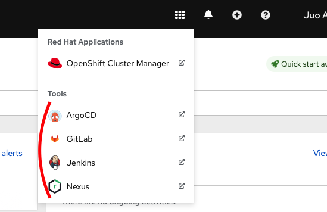

# Helper for Console Links

This a reusable template to avoid code repetition in other charts. To use this chart add it as a dependency and supply the correct values you'd like to include. There are no default sensible values only examples of how to use this chart.

The result is the Link in Application menu. This allows development teams, who do not have admin permissions (and cannot access certains namespaces to check the exact Route ) to quickly access the global tools (like argocd, gitlab, jenkins, grafana etc.)

