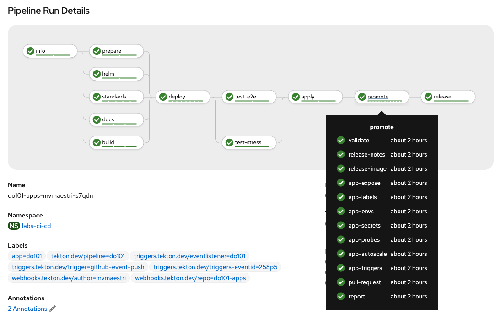

# Tekton-demo


This is an example of a pipeline developed in Tekton, the peaceful cat 🐈. It contains the main steps of a continuous software delivery process and it enforces a strict semantic version validation strategy, managing tag increments automatically for you.


There are several task templates available online. However, one of the biggest benefits of this chart is being able to take advantage of a model that holds all tasks in a solid and coherent way and with good linked parameters to be reused.



## Considerations

Seeking to minimize dependencies on other components and avoid building your own images, which can be a little overwhelming when you want to kickstart fast your project. So bash scripting is primarily used and provides a solid and easy model to be extended.

The different number of images being used has been taken into account. And with security in mind, only official images provided by Red Hat, Inc. are consumed. With [Red Hat Universal Base Image (UBI)](https://www.redhat.com/en/blog/introducing-red-hat-universal-base-image), you can take advantage of the greater reliability, security, and performance of official Red Hat container images where OCI-compliant Linux containers run. See also [Red Hat Ecosystem Catalog](https://catalog.redhat.com/software/containers/search).

The build strategy is based on [buildah](https://github.com/containers/buildah), which is a tool that facilitates building OCI container images.

The registry used is `registry.redhat.io` which means that you you will not be able to consume images unauthenticated. However, with an active subscription you can create a service account and apply a secret to the cluster to pull these images and this is covered in one of the following steps below.

- Learn more about [Red Hat Container Registry Authentication](https://access.redhat.com/RegistryAuthentication).


Furthermore, this package automatically manages the creation of three independent environments, which can be customized as needed.
The 3 different environments are:

- cicd
- development
- production

All the components corresponding to each environment were carefully introduced and are following the least privilege principle.

## Integrations

The integration with the Github repository is done through a token and with a secure password-less RSA key-pair to add new commits and tags. You will need to provide a valid, compatible, private key that is available to your Github account.

Besides that, it was designed to be plug and play. Upon installation, the webhook will be created automatically for you and all other data must come from the payload received through a new commit in your repository.

It also allows changing the status of each commit to pending or success depending on the result of the pipeline tasks. Developers can view the status of each commit in the Github interface.


## Deployments

The pipeline manages the creation of deployments for each environment and also takes care of enforcing standards such as code linting, chart linting, unit testing, code audit, and code coverage.

Images streams, deployments, services, and routes are created automatically through the pipeline, if necessary, at each new commit. This provides a repeatable way for software delivery and makes life easier for users who consume the application, whether for development or for other purposes.

All deployments are managed through `git push` by following a strict implementation of gitflow.
Currently supporting for the following branches, environment and and routes.

| Branch type | Upgrade | Docs | Dev | Prod | Hostname
| --- | --- | --- | --- | --- |  --- |
| `develop` |  | ✅ | ✅ | ⭕ | develop-myapp-development.apps.host.com |
| `feature/login` |  | ⭕ | ✅ | ⭕ | feature-login-myapp-development.apps.s45.core.rht-labs.com |
| `release/1.0.0` | minor* | ✅ | ⭕ | ✅ | v1-0-0-myapp-production.apps.s45.core.rht-labs.com |
| `hotfix/1.0.1` | patch | ✅ | ⭕ | ✅ | v1-0-1-myapp-production.apps.s45.core.rht-labs.com |
| `patch/1.0.2` | patch | ✅ | ⭕ | ✅ | v1-0-2-myapp-production.apps.s45.core.rht-labs.com |

*Obs: The first version `0.0.0` exceptionally will use a major upgrade to `1.0.0`.

A documentation based on [Slate](https://github.com/slatedocs/slate)  API docs generator will be also exposed for each environment through the routes hostnames:

- documentation-myapp-development.apps.s45.core.rht-labs.com
- documentation-myapp-production.apps.s45.core.rht-labs.com


## Installing

In this step by step we will assume the following values:

| Namespace | Value |
| --- | --- |
| CI-CD | labs-ci-cd |
| Development | do101-development |
| Production | do101-production |

If a ci-cd environment already exists, you can use it without the need to create a different one.

For the other two environments you have to ensure that they exist. If they do not exist, you can create following the example below;

    oc create namespace labs-ci-cd
    oc create namespace do101-development
    oc create namespace do101-production

## Configuration

To configure your own application and send it through the pipeline you must update the `values.yaml` file to reflect a repository to which you have access. Please use a repository name with a lowercase format.

It will be in this repository that the webhook will be automatically created and will trigger, on each new commit, a new PipelineRun on Tekton. You can create a new token on Github by [clicking here](https://github.com/settings/tokens), make sure to tick the `admin:repo_hook`, `repo` and `user` permissions.

### Secrets

The Github token will only be shown once, be sure to save it somewhere safe.
Then copy the token and replace it in the command below, replacing also your username. Please make sure you also update the namespace accordingly.

```
cat <<EOF | oc apply -f -
apiVersion: v1
kind: Secret
metadata:
  name: do101-github-webhook-secret
  namespace: labs-ci-cd
  annotations:
    tekton.dev/git-0: https://github.com
type: kubernetes.io/basic-auth
stringData:
  username: <yourusername>
  password: <token>
EOF
```

In order to avoid using passwords to publish new content on Github, we will use a keypair.
[Here's](https://docs.github.com/en/free-pro-team@latest/github/authenticating-to-github/generating-a-new-ssh-key-and-adding-it-to-the-ssh-agent) how to create one if you don't already have one available on your machine.

Assuming your private key was created in the default location `$HOME/.ssh/id_rsa`, you can run the command below to create a generic secret. Please note the secret metadata name here should match with the one provided in the `values.yaml`. Also, some more content is provided by Tekton regarding [secrets and authentication](https://github.com/tektoncd/pipeline/blob/master/docs/auth.md#configuring-ssh-auth-authentication-for-git).

```
pvtkey=$(cat $HOME/.ssh/id_rsa)
cat <<EOF | oc apply -f -
apiVersion: v1
kind: Secret
metadata:
  name: do101-github-deploy-secret
  namespace: labs-ci-cd
  annotations:
    tekton.dev/git-0: github.com
type: kubernetes.io/ssh-auth
stringData:
  ssh-privatekey: "$pvtkey"
EOF
```

To configure access to `registry.redhat.io` you need to create a new registry service account. Registry service accounts are named tokens that can be used in environments where credentials will be shared, such as deployment systems.

[Click here to create a new one](https://access.redhat.com/terms-based-registry), give it a name and fill in the description if you think it is necessary. Please save the username and token for further use.

Then copy the token and paste it into the snippet below

```
cat <<EOF | oc apply -f -
apiVersion: v1
kind: Secret
metadata:
  name: 11009103-tekton-pipeline-pull-secret
data:
  .dockerconfigjson: <tokenhere>
type: kubernetes.io/dockerconfigjson
EOF
```


### Applying

Great. Now that the secrets have been set up correctly we can install the package. For this, we will use helm, as below.

    helm template -f charts/tekton-demo/values.yaml charts/tekton-demo | oc apply -f-

How to verify that the installation was successful:

- See if you github webhook integration was created. Go to your github repository, click on Settings, and then on Webhooks.

You can check the webhook creation logs by searching for `webhook` in your pods in the `labs-ci-cd` namespace. If something has failed, you can delete TaskRun `create-do101-github-webhook`, update your webhook data from `values.yaml` and run the **Applying** step again.


### Policies

Before publishing a new commit, we will need to define some permissions for the pipeline ServiceAccount. This will allow the pipeline to move images from one environment to another.

```
oc policy add-role-to-user \
    system:image-puller system:serviceaccount:labs-ci-cd:do101-tekton-triggers-sa \
    --namespace=do101-development
```

```
oc policy add-role-to-user \
    system:image-puller system:serviceaccount:labs-ci-cd:do101-tekton-triggers-sa \
    --namespace=do101-production
```

And also for triggers ServiceAccount:

    oc adm policy add-scc-to-user privileged system:serviceaccount:labs-ci-cd:do101-tekton-triggers-sa -n labs-ci-cd
    oc adm policy add-scc-to-user privileged system:serviceaccount:labs-ci-cd:do101-tekton-triggers-sa -n do101-development
    oc adm policy add-scc-to-user privileged system:serviceaccount:labs-ci-cd:do101-tekton-triggers-sa -n do101-production
    oc adm policy add-role-to-user edit system:serviceaccount:labs-ci-cd:do101-tekton-triggers-sa -n labs-ci-cd
    oc adm policy add-role-to-user edit system:serviceaccount:labs-ci-cd:do101-tekton-triggers-sa -n do101-development
    oc adm policy add-role-to-user edit system:serviceaccount:labs-ci-cd:do101-tekton-triggers-sa -n do101-production

Something failed? See troubleshooting.

1. Check pod `create-do101-github-webhook-pod-kmc4p` and make sure the webhook was created correctly
2. Define policies


<!--

### Deploying to development environment

1. Create a new branch called `develop` and push to the repo to trigger a new build

    git checkout -b develop
    git push origin develop

2. Create a new branch called `feature/awesome-feature` and push to the repo to trigger a new independent build

    git checkout -b feature/awesome-feature
    git push origin feature/awesome-feature

### Deploying to production environment

1. From the latest `develop` branch, create a new branch called `release/1.0.0`

    git checkout -b release/1.0.0
    git push origin release/1.0.0

2. Patching and hotfixes folllows the same structure

    git checkout -b hotfix/1.0.1
    git push origin hotfix/1.0.1

    git checkout -b patch/1.0.2
    git push origin patch/1.0.2 -->

### Values


| Key | Test2 | Test 3 |
| --- | --- | --- |
| `application` | name | name of the application, used as prefix |
| `application` | runtime | supported `nodejs:[10,12,14]` |
| `application` | environments.cicd | pipeline will be deployed at this namespace |
| `application` | environments.development | images, services, routes, etc for development stage |
| `application` | environments.production | images, services, routes, etc for production stage |
| `pipeline` | sa.default | default service account for the pipeline |
| `pipeline` | .triggers | separate service account for tekton triggers |
| `pipeline` | nexus.host | npm repository host |
| `pipeline` | build | npm repository host |
| `pipeline` | build.s2i.context | context path for s2i build |

Supported webhooks under the `pipeline.webhook` object

| Provider | Param | Description 3 |
| --- | --- | --- |
| github | org | github organization |
| github | repo | repository to be integrated to the pipeline with automatic webhooks |
| github | user | github repository username |
| github | secret | a [github personal access token](https://github.com/settings/tokens) with `admin:repo` and `repo` permissions |
| github | secret | a [ssh keypair](https://docs.github.com/en/free-pro-team@latest/github/authenticating-to-github/adding-a-new-ssh-key-to-your-github-account) to allow to push content without password |
